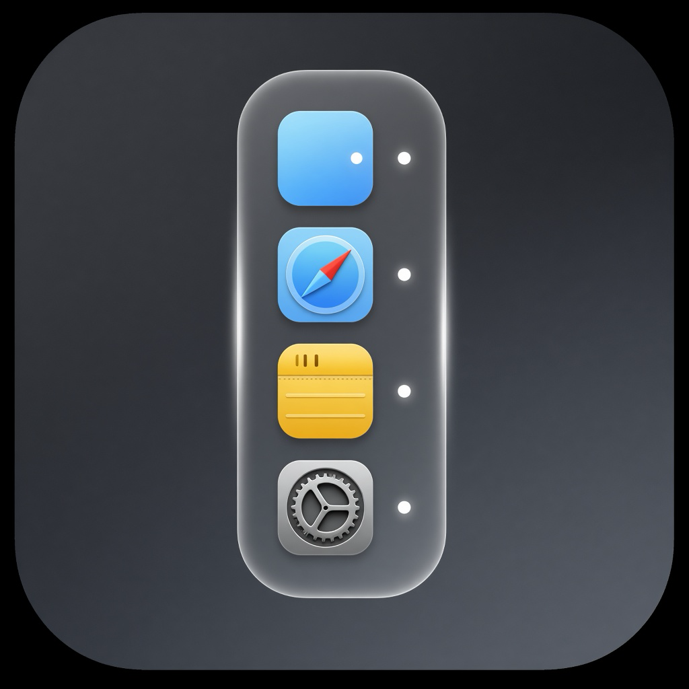
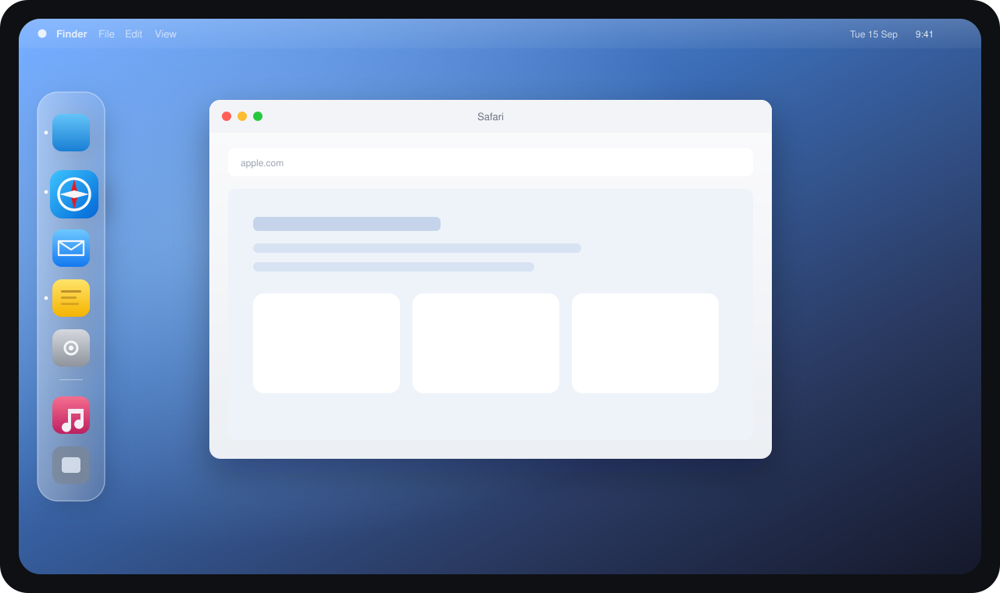

<p align="center">
  
</p>

<h1 align="center">SIDEDOCK</h1>

<p align="center">
  <strong>A secondary Dock for the unused edges of your Mac.</strong><br>
  Glass. Magnification. Auto-hide. Plaintext config.<br>
  No Accessibility. No Screen Recording.
</p>

<p align="center">
  
  
  
  
</p>

<p align="center">
  
</p>

The system Dock occupies one edge of one screen. Ultrawide and multi-display setups still leave a tall strip of unused space on the left or right. **SIDEDOCK** is a second Dock for that edge: pinned apps, recents, folders, and the same click-to-hide behavior you already know.

It is not a clone of [Sidebar](https://sidebarapp.net). It is the core Dock mechanic, written in Swift, auditable, and configured with a file you can keep in git.

## Why it exists

Wide Macs waste the sides. Most third-party docks either become a widget board, or they ask for Accessibility and Screen Recording so they can draw live window previews.

SIDEDOCK stays a Dock:

- A vertical glass panel on the **left** or **right** of **every display**
- Apps you pin stay there whether they are running or not
- Hover magnification with cosine falloff, neighbors spreading the way Apple’s Dock does
- Auto-hide, revealed by moving the pointer to the edge
- A JSON file at `~/.config/sidedock/config.json` that reloads live

If you want media controls, a calendar, or a window switcher, this is the wrong app. If you want the Dock on the side of an ultrawide, this is the one to build on.

## Features

| | |
| :--- | :--- |
| **Pin apps** | Stay on the dock when they are not running. Drag from Finder to add; drag to reorder. |
| **Click like the Dock** | Launch, focus, or hide the frontmost app. |
| **Magnification** | Hover enlarges the icon and pushes neighbors apart. Off, or 1.0–3.0. |
| **Auto-hide** | Approach the screen edge to reveal. Leave, and it springs away. |
| **Recents** | Unpinned apps you just used appear under a separator. Right-click to pin. |
| **Folders** | Drop a folder on the dock. Hover to peek inside; click an item to open it. |
| **Always visible** | Optional. macOS still will not shrink other windows around a third-party strip. |
| **Menu bar extra** | Settings, Open at Login, Recents, Reveal Config, Quit. The app itself stays out of the system Dock. |
| **Launch at login** | On by default the first time you run it. Turn it off from the menu bar or Settings. |
| **Running indicators** | Small dots for open apps, like the system Dock. |

Full idea-to-code map, including what is still out: [FEATURES.md](FEATURES.md).

## Privacy

SIDEDOCK does **not** request:

- Accessibility
- Screen Recording
- Input Monitoring

Edge detection uses `NSEvent` mouse monitors only. Apps launch through `NSWorkspace`. Folder drops store a path plus a security-scoped bookmark so the same code can stay sandboxed later for the App Store.

There are no live window previews, and there will not be unless the project later takes Screen Recording on purpose. That is a product decision, not a missing checkbox.

## Install

**Download the DMG, drag the app into Applications, open it once.** That is the whole setup.

1. Open `SIDEDOCK.dmg`.
2. Drag **SIDEDOCK** onto **Applications**.
3. Eject the disk image, then open SIDEDOCK from Applications.

On first launch the app:

- Lives in the menu bar (no icon in the system Dock)
- Writes `~/.config/sidedock/config.json` if it is missing
- Turns **Open at Login** on so it comes back after restart

If you open it from the disk image instead of Applications, it asks to move itself there first. That keeps the login item pointed at a copy that still exists after you eject the installer.

macOS may ask you to confirm the first open (Control-click → **Open**) until the build is notarized with an Apple Developer ID. Same account you will use later for the App Store.

### Build the DMG yourself

```bash
./scripts/make-dmg.sh
```

Output: `dist/SIDEDOCK-1.0.0.dmg` (and `dist/SIDEDOCK.dmg`). To sign with a Developer ID:

```bash
CODE_SIGN_IDENTITY="Developer ID Application: Your Name" ./scripts/make-dmg.sh
```

### Run from Xcode

Open `MacSideDock.xcodeproj`, select the **MacSideDock** scheme, and Run. Debug builds skip the move-to-Applications prompt and do not register a login item, so Xcode runs do not stick around after reboot.

### Requirements

- macOS 26.5 or later
- Xcode 26 to build from source

### App Store (later)

The DMG is the path for now. App Store submission needs an Apple Developer Program account, sandbox entitlements in `MacSideDock/MacSideDock.entitlements`, screenshots, and `Product → Archive`. Direct download stays unsandboxed so config, Finder drops, and login work without extra permissions.

## Use

Move the pointer to the left (or right) edge of the screen. The dock slides in.

| Action | Result |
| :--- | :--- |
| Click an app | Launch, focus, or hide if it is already frontmost |
| Drag an app from Finder | Pin it |
| Drag an icon | Reorder |
| Drop a folder | Pin it; hover to peek |
| Right-click an app | Open, Hide/Show, Show in Finder, Keep in Dock, Remove |
| Right-click the dock | Hiding, magnification, and position |
| Menu bar icon | Settings, login, recents, config, quit |

Settings is a small grouped window: size, magnification, edge, auto-hide, recents, and login. Re-open it from the menu bar, or by clicking the app in Finder (it handles reopen by showing Settings).

## Configure

Path: `~/.config/sidedock/config.json`

Edits on disk are picked up live. Invalid JSON is ignored until it parses again; the last good config stays in memory.

```json
{
  "autoHide": true,
  "edge": "left",
  "iconSize": 48,
  "lastMagnification": 1.8,
  "magnification": 1.8,
  "pinnedApps": [
    "com.apple.finder",
    "com.apple.Safari",
    "com.apple.mail",
    "com.apple.Notes",
    "com.apple.systempreferences"
  ],
  "pinnedFolders": [],
  "recentsLimit": 6,
  "reserveScreenSpace": false,
  "showRecents": true,
  "showRunningIndicators": true,
  "version": 3
}
```

| Key | Values |
| :--- | :--- |
| `edge` | `"left"` or `"right"` |
| `iconSize` | 24–96 |
| `magnification` | 1–3 (`1` is off) |
| `pinnedApps` | Bundle IDs, or `{ "bundleIdentifier": "com.apple.Safari" }` |
| `recentsLimit` | 3–12 |
| `reserveScreenSpace` | Always-visible mode; turns auto-hide off |

Menu bar → **Show Config in Finder** if you do not want to hunt for the file.

## Architecture

```
MacSideDockApp
└── AppDelegate
    ├── DockPanelManager          one NSPanel per display
    │   └── DockPanelController
    │       └── DockView          SwiftUI: icons, recents, folders, drop
    ├── StatusItemController      menu bar extra
    ├── RecentsStore
    └── DockConfigStore           ~/.config/sidedock/config.json
```

| Folder | What lives there |
| :--- | :--- |
| `Dock/` | Panel, glass, magnification, auto-hide, hover, folder peek |
| `Apps/` | Launch, click/hide, recents, login item, folder bookmarks |
| `Config/` | JSON model and live reload |
| `Preferences/` | Settings window, menu bar, feature catalog |

Magnification math is isolated in `Dock/DockMagnification.swift`. Reveal policy is isolated in `Dock/DockRevealLogic.swift`. Both are covered by tests in `MacSideDockTests/`.

## Contribute

SIDEDOCK is open source because the Dock is personal, and the feel has to be right on real hardware. If you care about that, you should be able to read the code, change it, and ship a build the same afternoon.

**Good first work:**

- A real macOS app icon (the asset catalog is still empty)
- Photographs of the running app for this README
- A Homebrew cask
- Localization
- Magnification and hide-show feel on your display
- Tests around config, recents, and drop insertion

Please read [CONTRIBUTING.md](CONTRIBUTING.md) before opening a pull request. Issues and PRs are welcome. The bar is native feel, not extra widgets.

Principles we will not casually reverse:

1. No Accessibility or Screen Recording for the core Dock.
2. Config stays a plaintext file a human can diff.
3. The app remains a Dock, not a sidebar of utilities.

## Out of scope

- Live window previews
- Media controls
- Calendar
- Window snapping
- Window switcher

These were considered and left out of v1. See [FEATURES.md](FEATURES.md).

## License

[MIT](LICENSE) © Mohammad Rehan
